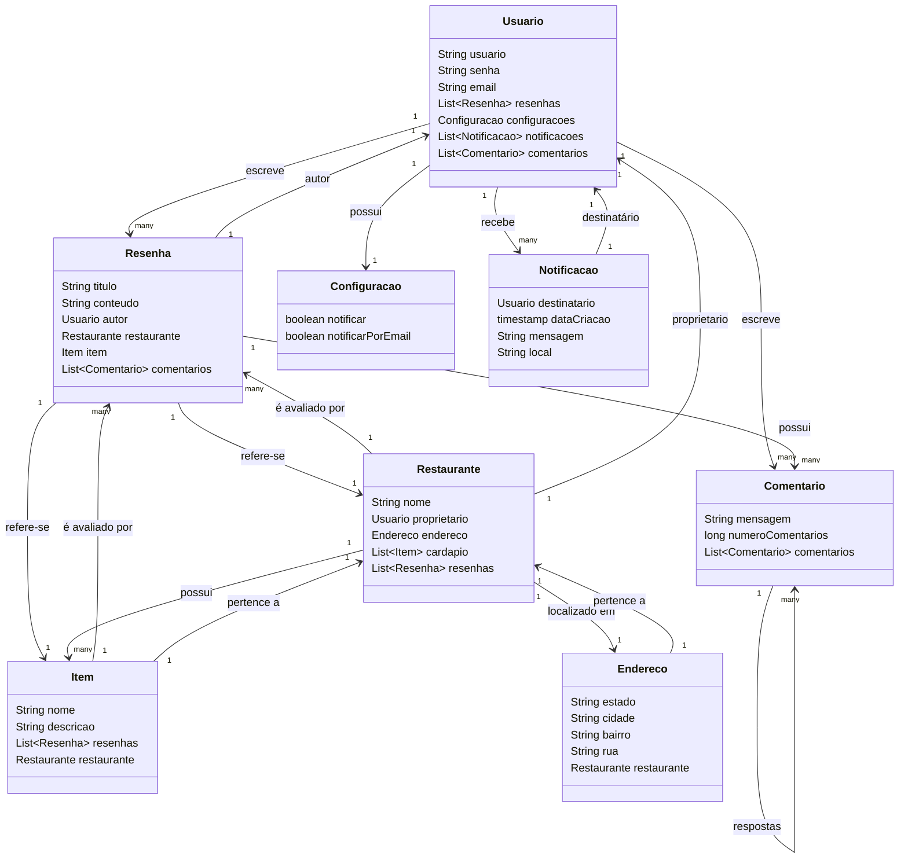

# BroAvaliacao-Back-End
Back-End para o sistema de avaliação de broas que será apresentado no final da disciplina de desenvolvimento web 2 do curso de Tecnologia em Análise e Desenvolvimento de Sistemas.

